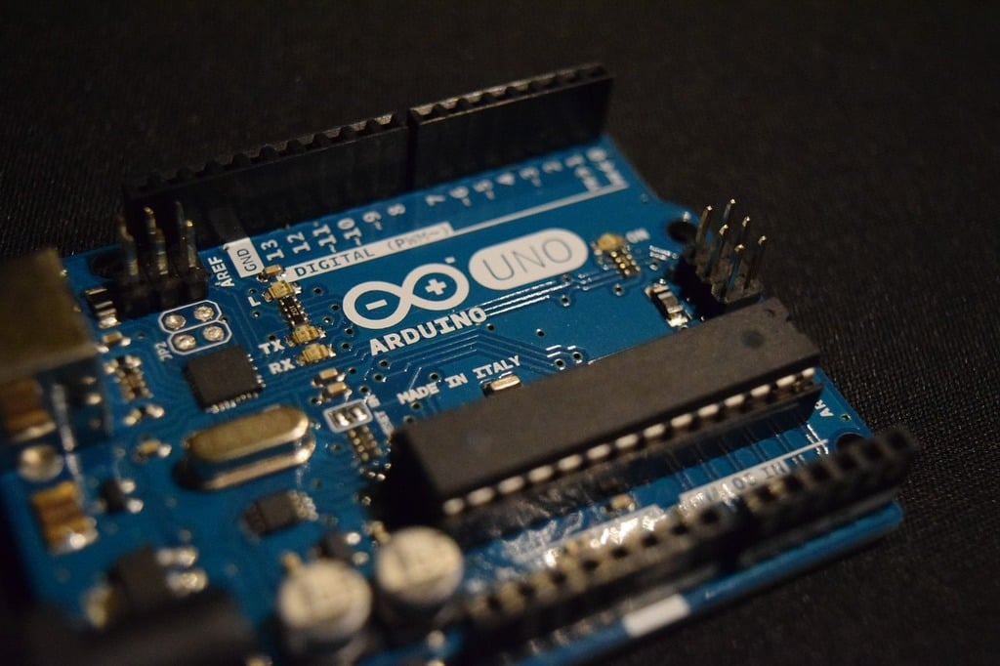

# Introduction

**Welcome to ArduinoMap!** 

ArduinoMap is a free, open source Arduino curriculum designed to help beginners build strong foundations and develop good practices from day one.  

When I first tried to learn Arduino, it was an overwhelming experience. Most resources jumped ahead too fast or skipped the fundamentals. I struggled to find a clear, practical roadmap that would support beginners and aspiring hobbyists wanting to explore the world of Arduino. 

ArduinoMap was built to change that.

## Curriculum

The curriculum is organized into weekly modules, with each week focusing on software (programming), followed by lessons on hardware. By the end of the course, you will be able to play around with an assortment of modules which include sensors, displays and motors to build cool, unique, and valuable projects. 

Rather than hand holding you through the course, this course encourages **learning by doing**. You will be provided schematics, links to documentation, and other valuable resources to explore concepts in greater depth and learn. 

Each lesson begins with an introduction to the topic, followed by a lesson which can be followed. Lastly, each lesson will be coupled with an assignment so that you can apply the knowledge you have gained.

## Software

To follow along with this course, you will need to download the Arduino IDE to program your microcontroller and upload code examples that are provided. [Click here to download the IDE.](https://www.arduino.cc/en/software/)

## Hardware

To truly involve yourself with the lessons and experience what the Arduino has to offer, I would recommend purchasing an Arduino kit which contains many of the sensors, input and output devices we will come across in this course. Some kits that are recommended include:
- [Official Arduino Start Kit](https://store.arduino.cc/products/arduino-starter-kit-multi-language)
- [ELEGOO's Super Starter Kit](https://us.elegoo.com/products/elegoo-uno-r3-super-starter-kit)

Alternatively, if you are on a budget, there are many *free-to-use* Arduino simulators that are great to work with. Check out:
- [Tinkercad](https://www.tinkercad.com/circuits)
- [Wokwi](https://wokwi.com/)

## Mindset

I am a big advocate for [learning by doing](https://en.wikipedia.org/wiki/Learning-by-doing), which encourages learning concepts **actively** rather than passively. Following tutorials is great; but it ultimately restricts you. If you get stuck, reach out on one of the many communities, forums and servers available to help you. Some friendly communities include:
- [Arduino Forum](https://forum.arduino.cc/)
- [Arduino Discord Server](https://support.arduino.cc/hc/en-us/articles/4405329164178-Join-the-official-Arduino-Discord-server)

Let's dive right in!