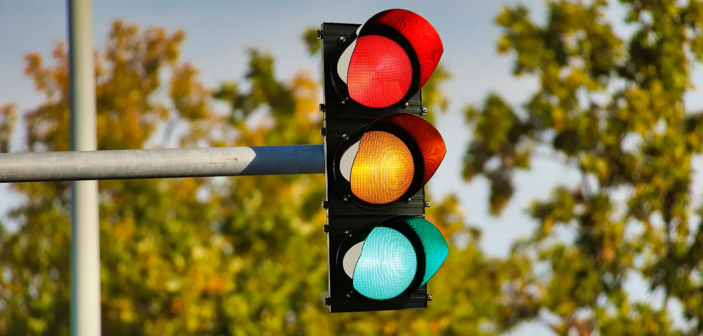

# Project: Traffic Lights

Projects are intended to consolidate the knowledge you have absorbed in previous lessons. This one will help you apply what you've learned about controlling LEDs. 

In this project, you will simulate a basic traffic light system using three LEDs: red, yellow and green. Requirements: 
- Wire up the three LEDs correctly
- Make the LEDs blink one after each other, cycling through red, yellow, and then green. 
- The green LED must stay on longer than the yellow and red LED. The green LED should stay on for 3 seconds, the yellow LED should stay on for 1 second and the red LED should stay on for half a second. 

## Assignment 

:::info Project

**Step 1: Planning**

1. Think about the components you will need for this project. Will you need to use resistors?
2. Begin planning how these components will link together. How many digital pins will you require?
3. Draw up a schematic using a tool like [`Fritzing`](https://fritzing.org/) or by hand, if you prefer. This will help you construct the circuit on a breadboard - it's good practice.

**Step 2: Building your circuit**

1. Gather all the components you will need for this project. 
2. Build the circuit using your breadboard, jumper wires and the components you would have prepared earlier. Make sure that polarized components are connected in the correct direction. 
3. Hint: you learnt how to wire up a single LED last lesson. Now you need to do it **three** times.

**Step 3: Programming**

1. Declare all the variables you will need to use in this program. Try to use variables whenever it's possible.
2. Program your LEDs using the functions you learned about last lesson. Remember to comment your code throughout since it is important for creating maintainble programs.
3. Upload your code, debug, and repeat until you have a working program!
:::

## Stuck?

If you get stuck, don't worry! There are a few helpful ways to troubleshoot and understand the problem. 

- Refer to official documentation or guides such as the [Arduino Docs](https://docs.arduino.cc/).
- Search the problem online. If your console reports an error, simply copy paste it online. It's likely someone else had the same issue as you. 
- Ask in forums and online communities. Good places to ask for help are:
    - [Arduino Forum](https://forum.arduino.cc/)
    - [Arduino Discord Server](https://support.arduino.cc/hc/en-us/articles/4405329164178-Join-the-official-Arduino-Discord-server)