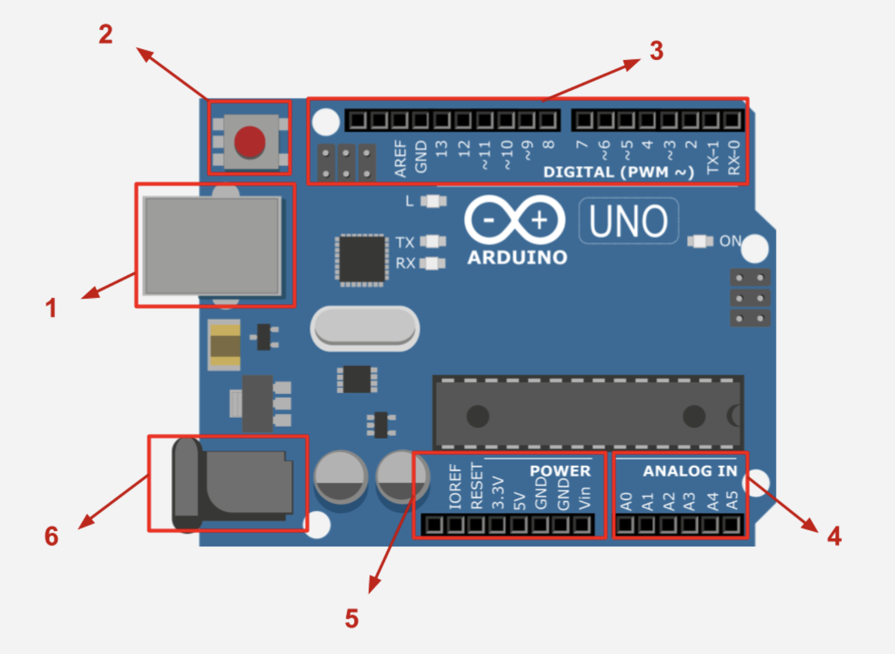

# What is the Arduino?

[Arduino](https://en.wikipedia.org/wiki/Arduino) is an open-source electronics company who have developed mutliple microcontrollers that allow users to create projects by connecting various sensors, actuators, and other input/output devices and programming them with a variant of the `C++` programming language. The Arduino Uno is a development board that utilizes the `ATmega328P` microcontroller from the Atmel AVR family. 

:::note[Microcontroller vs Computer]
A computer is a general purpose device that performs multiple functions whilst a microcontroller is designed to run one program at a time. 
:::

## Structure of the microcontroller

If you purchased an Arduino kit as advised in the [Introduction](intro.md/hardware), grab your Arduino Uno R3 and let's understand the structure of your microcontroller. 

 

  
1. USB connector
    - A port used to power your Arduino and/or upload code.
2. Reset button
    - Used to restart the microcontroller.
3. Digital pins
    - 14 digital input/output pins which can be configured to a HIGH (5V) or a LOW (0V) state.
    - Pins marked with ~ support Pulse Width Modulation (PWM) and can be used to dim LEDs, control motor speeds and more. Don’t worry about this for now.
4. Analog pins
    - Used for reading analog voltage levels.
5. Power pins (provide methods to supply voltage to components) 	
    - Vin is used for external power.
    - 5V and 3.3V pins are used for regulated voltage outputs.
    - GND pins are used to provide a return path for current (grounding).
6. Power connector 
    - A barrel jack connector which can also be used to power your microcontroller.

## Assignment 

:::info Try It Yourself
1. Explore the official documentation for your [Arduino Uno](https://docs.arduino.cc/hardware/uno-rev3/). We will visit the Arduino documentation regularly, so bookmarking [this page](https://docs.arduino.cc/) is advised. 
2. The Uno is one of many microcontrollers made by the Arduino company. Go ahead and visit [this website](https://dronebotworkshop.com/meet-the-arduino-family/) to meet the Arduino family.
::: 

## Next Steps

This section includes links to help you dive deeper into the topics from this lesson. It's optional, so don't worry if you choose to skip it.

- [A great video that summarises this lesson.](https://www.youtube.com/watch?v=HIXnwFB902M)
- [Sparkfun's comparison guide is an interesting exploration of different microcontrollers.](https://www.youtube.com/watch?v=hjRSwBcLcSU)