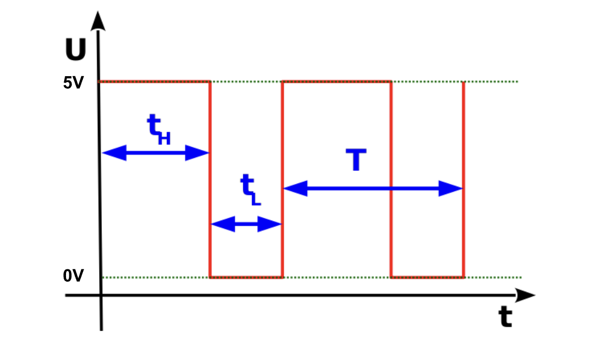

# Understanding PWM

Until now, we have learnt how to turn an LED either fully on (by supplying **5V**), or off (by supplying **0V**). Pulse Width Modulation (PWM) is useful in many different applications, but for now, just remember it can be used to vary the brightness of an LED. 

## What is PWM?

[Pulse Width Modulation (PWM)](https://en.wikipedia.org/wiki/Pulse-width_modulation) is a technique which generates a continous `HIGH` and `LOW` alternating signal by turning a pin on and off extremely fast. 

PWM works by sending a PWM signal, which is essentially a square wave. This is what a PWM signal looks like:



As you can see, the wave spends a varying amount of time in 5V and 0V which represent the `HIGH` and `LOW` states respectively. There are a few terms in the diagram above that you should understand:

- **t<sub>H</sub>** - time for which the signal is `HIGH`
- **t<sub>L</sub>** - time for which the signal is `LOW`
- **T** (Period) - total time for which the signal is `HIGH` and `LOW`. Therefore, it is t<sub>H</sub> + t<sub>L</sub>.

### Duty cycle

A [duty cycle](https://en.wikipedia.org/wiki/Duty_cycle) is the fraction of time for which a signal stays `HIGH` (**t<sub>H</sub>**) during one complete period (**T**). Essentially, it tells us how long the pin stays on compared to how long it stays off. Therefore, 

- A **100% duty cycle** would mean that an LED is fully on.
- A **50% duty cycle** would mean that an LED is dim.
- A **0% duty cycle** would mean that an LED is always off. 

## Using PWM with an LED

We can use PWM to vary the brightness of an LED by writing an **analog** value (PWM signal) to a pin. Note that not all pins are capable of supporting PWM. We have to use pins that are marked with a `~`.


### `analogWrite()`

To write a PWM signal to a pin, we use the [`analogWrite()`](https://docs.arduino.cc/language-reference/en/functions/analog-io/analogWrite/) function.

```cpp
analogWrite(pin, value);
```

- The `value` represents the duty cycle - between 0 (always off) and 255 (always on). This is because Arduino uses an 8-bit resolution for the `analogWrite()` function. This means that:
    - `analogWrite(pin, 0)` results in a 0% duty cycle.
     - `analogWrite(pin, 255)` results in a 100% duty cycle.


:::tip Example
Let's try to create an example program where we dim an LED and then increase the brightness. The following example has the LED connected to pin `~9` since it supports PWM.

```cpp
void setup() {
  pinMode(9, OUTPUT);
}

void loop() {
  analogWrite(9, 50);   // Dim light
  delay(1000);
  analogWrite(9, 200);  // Increase brightness
  delay(1000);
}
```
:::

## Assignment 

:::info Your Turn
1. Connect an LED to a pin on your Arduino board that supports PWM. Ensure you hook up your circuit correctly.  
2. Write a program to fade the LED on and off using the `analogWrite()` function you have learnt. Hint: you will have to use a `for` loop. 
::: 

## Next Steps

This section includes links to help you dive deeper into the topics from this lesson. It's optional, so don't worry if you choose to skip it.

- [This video](https://www.youtube.com/watch?v=YmPziPfaByw) explains PWM well. Check it out.