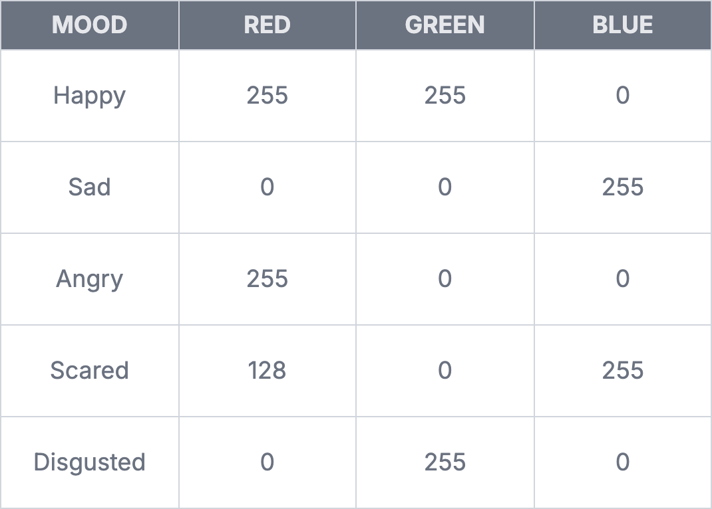

# Project: Mood Light

Projects are intended to consolidate the knowledge you have absorbed in previous lessons. This one will help you apply what you've learned about the RGB LED.

In this project, you will create a mood light controller using an RGB LED. Requirements: 
- Build an RGB LED circuit.
- Ask the user to type a mood (`happy`, `sad`, `angry`, etc) using the serial monitor. 
- Use `analogWrite()` to mix colors. Hint - you will have to use conditional statements in this project. 

## Assignment 

:::info Project

**Step 1: Planning**

1. Think about the components you will need for this project and start planning how these components will fit together in a circuit. 
2. Draw up a schematic using a tool like [`Fritzing`](https://fritzing.org/) or by hand, if you prefer. 

**Step 2: Building your circuit**

1. Gather all the components you will need for this project. 
2. Build the circuit using your breadboard, jumper wires and the components you would have prepared earlier. 

**Step 3: Programming**

1. Declare all the variables you will need to use in this program. Try to use variables whenever it's possible. Write your program using the requirements above. Use this chart to map each mood to an RGB color.

3. Upload your code, debug, and repeat until you have a working program!

**Challenge**

1. What happens when you type in a mood like `aNgRy`? Notice that you recieve an error, even though the spelling is correct. This is because the comparison is case-sensitive. To avoid this, we can convert the user's input to lowercase before comparing it using `if` statements. Read [this documentation](https://docs.arduino.cc/language-reference/en/variables/data-types/stringObject/Functions/toLowerCase/) and learn how to implement this on your own.
:::

## Stuck?

If you get stuck, don't worry! There are a few helpful ways to troubleshoot and understand the problem. 

- Refer to official documentation or guides such as the [Arduino Docs](https://docs.arduino.cc/).
- Search the problem online. If your console reports an error, simply copy paste it online. It's likely someone else had the same issue as you. 
- Ask in forums and online communities. Good places to ask for help are:
    - [Arduino Forum](https://forum.arduino.cc/)
    - [Arduino Discord Server](https://support.arduino.cc/hc/en-us/articles/4405329164178-Join-the-official-Arduino-Discord-server)