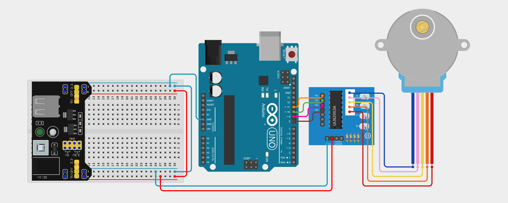

import Tabs from '@theme/Tabs';
import TabItem from '@theme/TabItem';

# Stepper Motors

Stepper motors can be used to produce motion in small *steps*. This allows us to program stepper motors to make very precise movements and this is why stepper motors are often used in 3D printers and robotic arms.

## How it works

A stepper motor works by converting electrical pulses into motion by using multiple coils. Unlike servo motors, a stepper motor cannot be connected directly to your Arduino board. This is because it requires more voltage that the Arduino can provide.

To avoid this, we have to use a motor driver module such as the `ULN2003` driver board. This driver allows us to construct our circuit with easy and provide power to our stepper motor. 

## Constructing your circuit

Components required:
- 1x Stepper motor eg. `28BYJ-48`
- 1x `ULN2003` driver module
- 1x Power supply module
- Breadboard
- Jumper wires (both male-male and female-male)
- Arduino board 

:::info[Try it yourself]
<Tabs>
  <TabItem value="problem" label="Problem">
    Search up your servo motor's datasheet and pinout online. Then, try to build your circuit on the breadboard. You can use this layout to help:

    - Connect your stepper motor to your motor driver
    - Motor driver (ULN2003) connections to Arduino
        - IN1 → Pin 11
        - IN2 → Pin 10
        - IN3 → Pin 9
        - IN4 → Pin 8
        - VCC → Breadboard 5V rail
        - GND → Breadboard GND rail
    - Connect your power supply module to your breadboard, ensuring that the positive and negative terminals are in line with your breadboard's power rails. 
  </TabItem>
  <TabItem value="solution" label="Solution">
    Below is the equivalent circuit diagram for this layout. Did you hook up your components correctly?

    

      
  </TabItem>
</Tabs>
:::

## Programming your blank

## Assignment 

:::info Your Turn
1. 
:::

## Next Steps

This section includes links to help you dive deeper into the topics from this lesson. It's optional, so don't worry if you choose to skip it.

- 