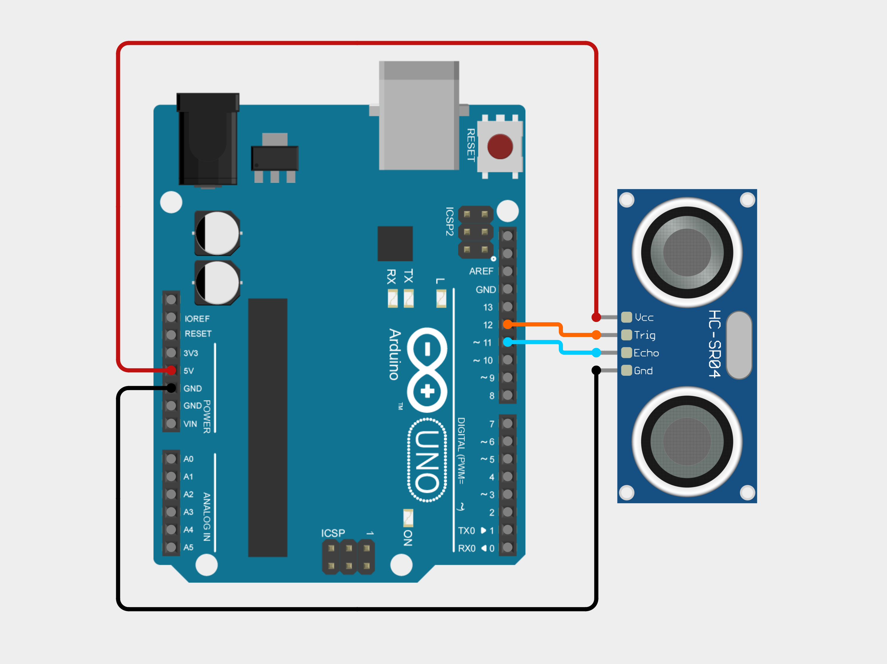

import Tabs from '@theme/Tabs';
import TabItem from '@theme/TabItem';

# Ultrasonic Sensors

An ultrasonic sensor is a distance sensor which can be used to create projects that measure distance, for example, in obstacle avoiding robots. 

## How it works

We will learn about using the `HC-SR04` ultrasonic sensor since it is relatively simple and straightforward to interface with. Since it is an *ultrasonic* sensor, the module works by sending a sound wave at ultrasonic frequency and waits for it to be reflected back. The time between the transmission of the wave and recieving of the wave is used to calculate the distance. 

- Trigger (Trig) pin → sends out a short ultrasonic “ping” (like sonar).
- Echo pin → listens for the reflection (bounce back) of that ping.

## Constructing your circuit

Components required:
- 1x `HC-SR04` ultrasonic sensor 
- Arduino board
- Jumper wires (female-male)

:::info[Try it yourself]
<Tabs>
  <TabItem value="problem" label="Problem">
    Search up your ultrasonic sensor's datasheet online. Datasheets will be your friend when learning about new components since they provide all the necessary information you will need to construct your circuit. Try building your circuit using this schematic:
    
    <div class="img-center"></div>
    <br></br>
  </TabItem>
  <TabItem value="solution" label="Solution">
    Below is the equivalent circuit diagram for this schematic. Did you hook up your components correctly?

    <div class="img-center"></div>
    <br></br>
  </TabItem>
</Tabs>
:::

## Programming your ultrasonic sensor

To begin programming our ultrasonic sensor, we need to first include the ultrasonic sensor library.

```cpp
#include "SR04.h"  
```

Then, instead of writing out the math which will compute the distance, we can simply call a function:

```cpp
#define TRIG_PIN 12
#define ECHO_PIN 11
SR04 sr04 = SR04(ECHO_PIN,TRIG_PIN);
long dist;
```

Then, we can use the `sr04` object to calculate the distance and print it out to our serial monitor. The completed example sketch, therefore, is as follows:

```cpp
#include "SR04.h"
#define TRIG_PIN 12
#define ECHO_PIN 11

SR04 sr04 = SR04(ECHO_PIN,TRIG_PIN);
long dist;

void setup() {
   Serial.begin(9600);
}

void loop() {
   dist = sr04.Distance(); // Sensor gets distance
   Serial.print(dist); // Prints distance 
   Serial.println("cm"); 
   delay(750);
}
```

## Assignment 

:::info Your Turn
1. Create a circuit with your ultrasonic sensor and a buzzer to simulate a simple walking stick system for the visually impaired. If the distance is less than `20cm`, the buzzer will beep to warn of an obstacle. For a challenge, make the buzzer beep faster the closer you are to an object. 
:::

## Next Steps

This section includes links to help you dive deeper into the topics from this lesson. It's optional, so don't worry if you choose to skip it.

- [Read this to understand more about how an ultrasonic sensor works.](https://maxbotix.com/blogs/blog/how-ultrasonic-sensors-work)